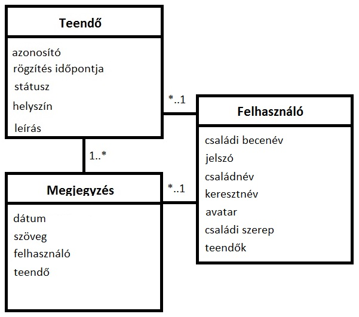

# bead1
This is my first repository on GitHub.

# Dokumentáció

A dokumentáció a következő részeket tartalmazza:
•	Követelmény
•	Tervezés
•	Implementáció
•	Tesztelés
•	Felhasználói dokumentáció

## Követelményanalízis

Gyűjtsük össze a követelményeket a Family ToDo alkalmazásról. Nézzük meg, hogy melyek a felhasználók által elvárt funkciók, amelyekkel rendelkezni szükségeltetik az alkalmazásunknak:

1. Követelmények összegyűjtése: a nyújtandó szolgáltatások ismertetése rövid, szöveges leírásként, sokszor felsorolásként jelenik meg.
	1. Funkcionális elvárások:
		* Lehessen regisztrálni az oldalra.
		* A regisztrált felhasználók be tudjanak lépni az oldalra, hogy használhassák az alkalmazás funkcióit.
		* Meg lehessen tekinteni a már felvett teendőket.
		* Lehessen felvenni új teendőket.
		* A már felvett teendőket lehessen módosítani.
		* A már felvett teendőket lehessen törölni.
		* Lehessen megjegyzést fűzni teendőkhöz.
		* A bejelentkezett felhasználók képesek legyenek kijelentkezni.
	2. Nem funkcionális követelmények:
		* Jelezze az alkalmazás, hogy ki a bejelentkezett felhasználó.
		* Jelezze az alkalmazás, ha regisztrációnál hibás adadtot viszünk be.
		* Jelezze az alkalmazás, ha új teendő felvitelénél hibásan töltöm ki az adatokat.
		* Jelezze az alkalmazás, ha az új teendőt sikeresen felvettem.
		* Jelezze az alkalmazás, ha az új teendőt sikeresen módosítottam.
		* Jelezze az alkalmazás, ha az új teendőt sikeresen töröltem.

2. Szakterületi fogalomjegyzék: ha vannak speciális fogalmak, akkor ezeket itt lehet összegyűjteni és magyarázni.
	* Todo: A szó jelentése az, hogy csinálni, tenni. Tehát ez egy olyan fogalom, amellyel egy olyan listát jelölünk, amelyre följegyeztük azokat a tevékenységeket, amelyeket meg akarunk csinálni a közeljövőben.
	* Family role: Az adatbázisban tárolt felhasználók betöltött szerepét jelenti.
	* Kid: Jelentése gyerek, az adatbázisban az egyes felhasználók egyik tulajdonsága, a családi szerep egyik lehetősége.
	* Parent: Jelentése szülő, az adatbázisban az egyes felhasználók egyik tulajdonsága, a családi szerep másik lehetősége.
3. Használatieset-modell
	1. Szerepkörök:
		* Vendég: Meglátogathatja az oldalt, de betekintése nincs a teendők listájába. Csak a bejelentkezési illetve a regisztrációs felületet érheti el.
		* Gyerek: Meglátogathatja az oldalt. Megnézheti a teendők listáját. Felvehet új teendőket, és módosíthat is már meglévő teendőket. Azonban teendőket nem törölhet.
		* Szülő:  Meglátogathatja az oldalt. Megnézheti a teendők listáját. Felvehet új teendőket, módosíthatja őket és törölheti is azokat.
	2. Használati eset diagramok: a szerepkörök és az elérhető funkiók kapcsolatát jelenítik meg:
		* 
	3. Folyamatok pontos menete: legalább 1 folyamat kifejtése.
        ```
		> Egy vendég ellátogat a kezdőoldalra. Rákattint a Bejelentkezés feliratra, amely elnavigálja a a vendéget a /login oldalra.
		Itt rákattint a Regisztráció feliratra, amely ekkor elnavigál a /signup oldalra. Itt megfelelően kitölti a Családnév, Keresztnév, Családi becenév, Jelszó és esetleg az Avatar mezőket.
		Ezután rákattint a Submit gombra, amellyel megfelelő kitöltés esetén bekerülnek az adatai az adatbázisba és visszanavigál a bejelentkezési oldalra, ahol már a családi becenevével és a jelszavával beléphet, úgy hogy ezeket beírja és rákattint a Submit gombra.
		Ekkor az alkalmazás elnavigál a Családi teendők listájára, /todos. Itt a bejelentkezett felhasználó, akinek az alapértelmezett Családi szerepe "kid", ha rákattint az új teendő felvétele gombra, amely elnavigálja a /todos/new Új teendő felvitele oldalra.
		Ekkor kitöltve a helyszín és a leírás mezőket és rákattintva a Submit gombra az alkalmazás elnavigál a Családi teendők listájára, /todos, és kiírja, hogy új teendő sikeresen létrehozva. Ekkor már a bejelentkezett felhasználó láthatja az általa felvett teendőt.
		Ezek után, ha a felhasználó rákattint az általa létrehozott tevékenység melletti módosítás gombra az alkalmazás elnavigál a teendő módosítása oldalra, /edit:id. Ahol a már megadott adatokkal ki vannak töltve, a Státusz, Helyszín és Leírás mezők.
		Ha már megcsinálta lelkiismeretesen a bejelentkezett felhasználó az adott feljegyzést, akkor megváltoztatja a Státuszt, done-ra, vagy ha a szülő le is ellenőrizte, akkor checked-re és rákattint a Submit gombra.
		Ekkor az alkalmazás visszanavigál a Családi teendők listája oldalra, /todos, és kiírja, hogy a teendő sikeresen módosítva. Ekkor már a módosított tevékenységet írja ki a listára. Mivel a Családi szerepe csak "kid", ezért törölni nem tud tevékenységeket.
		Rákattintva a kijelentkezés gombra az alkalmazás visszaviszi az immáron kijelentkezett vendéget a kezdőoldalra.
		```


## Tervezés

### 1.	Architektúra terv
-Family_ToDo:
    *bower.json
    *fooldal.html
    *package.json
    *server.js
-config:
    *waterline.js
-controllers:
    *comment.js
 	*index.js
 	*login.js
 	*todo.js
-models:
    *comment.js
 	*todo.js
 	*user.js
-node_modules
-public
-test:
    *usermodel.test.js
 	*zombie.test.js
-views:
    *index.hbs
 	*layout.hbs
 	-login:
 	    *index.hbs
 		*signup.hbs
 	-todos:
 	    *delete:id.hbs
 		*edit:id.hbs
 		*list.hbs
 		*new.hbs

### 2. Oldaltérkép

1. Kezdőoldal:
    * Bejelentkezés
    * Regisztráció
2. Családi teendők listája:
    * Új teendő felvétele
    * Teendő módosítása
    * Megjegyzés
    * Kilépés

### 3. Végpontok:

1. / : index
2. /logout : kijelentkezés és visszajutás az index-hez
3. /todos/list : teendők listája
4. /todos/new : új teendő felvétele
5. /todos/edit:id : egy teendő szerkesztése
6. /todos/delete:id : egy teendő törlése
7. /login : bejelentkezési oldal
8. /login/signup : regisztrációs űrlap
9. /comment : megjegyzés

A végpontok elérése és egyik végponttól a másik végpontig való eljutás a controllers mappában lévő .js állományokkal történik. Ezért vannak a főoldalhoz, a bejelentkezéshez, a teendőkhöz és a kommentekhez egy-egy kontroller.

### 4.	Osztálymodell




## Implementáció
 
###	Fejlesztői környezet bemutatása:

A fejleszői környezetetként a Cloud9 nyújtott segítséget a következőkkel:
    - Könnyű áttekinthetőség a könyvtárszerkezet baloldali elhelyezésében.
    - Jó átláthatóság a kódszerkesztőjének köszönhetően, jó blokk és szövegkiemelés.
    - Könnyen futtatható teszt fájlok.
    - Az alkalmazás felhasználó által kézzel is könnyen tesztelhető a Preview-ban.

## Tesztelés

Automatikus tesztek szükségesek. Nem kell teljeskörű tesztelés, a hallgató mutassa meg, hogy képes ilyen tesztek írására.
1.	Egységtesztek: legalább 1 adatmodell tesztelése: usermodel.test.js:
    * A usermodel.test.js-ben azt teszteljük le, hogy egyáltalán működik-e.
        - Leteszteljük, hogy létre tudunk-e hozni egy felhasználót.
		- Leteszteljük, hogy utána meg tudjuk-e találni ezt a felhasználót a Családi beceneve alapján.
		- Leteszteljük, hogy tudjuk-e módosítani az adott felhasználót.
		- Leteszteljük, hogy hibát ad-e vissza, ha rosszul adtunk meg adatot.

2.	Funkcionális felületi tesztek: legalább 1 folyamat tesztelése zombie.js használatával
    * A zombie.test.js-ben azt teszteljük le, hogy jól működik-e az új teendő felvétele funkció.
        - Leteszteljük, hogy meg tudjuk-e látogatni egyáltalán a kezdőlapot.
		- Leteszteljük, hogy meg tudjuk-e látogatni az új teendő felvétele oldalt.
		- Leteszteljük, hogy oda lép-e a /login bejelentkező oldalra.
		- Leellenőrizzük, hogy be tudunk-e jelentkezni valós/helyes adatokkal.
		- Leteszteljük, hogy belépve elérjük-e a családi teendők listája oldalt.
		- Leteszteljük, hogy elérjük-e a /todos/new, új teendők felvitele oldalt.
		- Leteszteljük, hogy hibásan megadott értékek esetén hibát dob-e az oldal.
		- Leteszteljük, hogy helyes adatok megadása és Submit gomb nyomása esetén megfelelően visszalép-e a /todos oldalra, megjelenítve az újonnan felvett tevékenységet.

## Felhasználói dokumentáció

### Family_ToDo

#### Dokumentáció

```
> Mielőtt elkezdjük használni a Family ToDo honlapot el kell indítanunk a postgresql adatbázist, kapcsolóni kell hozzá.
Ezután már látogatható az oldal. Tehát a kezdő képernyőt egy vendég is nézegetheti, ahol talál leírást arról, hogy mire is való ez az oldal, mire lehet/érdemes használni.
Szóval, ha valaki szeretné használni is, és valódi teendőit följegyezgetni, akkor először is be kell lépni az oldalra. Ehhez a jobb fölső sarokban lévő Bejelentkezés gombra kell kattintani. Ha már regisztrálva vagyunk, akkor bejelentkezéshez írjuk be a családi becenevünket és jelszavunkat, majd kattintsunk a Submit gombra.
Abban az esetben viszont, ha nem vagyunk még regisztrálva, akkor kattintsunk a Regisztráció gombra és adjuk meg a következő adatainkat:
-Családnév, -Keresztnév, -Családi becenév, -Jelszó, -Avatar URL. Ha ezekkel megvagyunk, akkor kattintsunk a Submit gombra. Ekkor már a megadott Családi becenevünkkel és jelszavunkkal be tudunk jelentkezni a Bejelentkezés oldalon.
Bejelentkezve a fönti menüben megjelenik, hogy Üdv, "felhasználónév"! és egy Kilépés opció, melyre kattintva kiléptetjük a felhasználót az alkalmazásból és vissza visszük a kezdőoldalra.
Viszont, ha maradunk bejelentkezve, akkor láthatjuk a család teendőit listába szedve. Minden egyes elvégzendőről látjuk, hogy mikor lett a listához adva; mi a státusza, tehát hogy újonnan felvett, vagy már elkészített, vagy esetleg már le is ellenőrzött; a helyszínét, hogy hol kell a feladatot elvégezni; a leírásást, hogy pontosan mit is kell csinálni és további lehetőségeket, melyek sorban:
- Teendő módosítása, - Megjegyzés, - Teendő törlése.
Az oldal legalján láthatunk egy "Új teendő felvitele" gombot, amelyre rákattintva eljutunk egy Új teendő felvétele oldalra, ahol űrlapként kitöltve a "Helyszín" és "Leírás" feliratokkal ellátott mezőket, és a Submit gombra rákattintva vehetünk fel a listára új teendőket. Ekkor, ha mindent sikeresen kitöltöttünk, akkor visszavisz minket a listához és megjelenik egy felirat, hogy "Új teendő sikeresen felvéve!". Ekkor az újonnan feljegyzett feladat már a listában van.
Ha viszont az Új teendő felvétele oldalon a Cancel gombra kattintunk, akkor a már beírt adatokat visszatörli/reset-eli.
A Családi ToDo feliratra kattintva visszajuthatunk a Teendők listája oldalra. Itt a már említett lehetőségeket választhatjuk minden egyes teendőre.
Tehát egy már meglévő teendőt módosíthatunk a mellette lévő "Teendő módosítása" gombbal, amely elvisz minket egy "Egy elvégzendő dolog módosítása" oldalra, ahol láthatjuk az adott teendő adatait, mint például a Felvételének időpontját, a Státuszát, a Helyszínét és a Leírását. Ez ismételten egy űrlap, amely már előre ki van töltve a tárolt adatokkal, de változtathatunk is rajtuk. A Submit gombra kattintva véglegesíthetjük a változtatást, mely ismét visszavisz minket a Teendő listája oldalra, ha megfelelően töltöttük ki az adatokat, és ekkor megjelenik az oldal tetején az a felirat, hogy "A teendő sikeresen módosítva!". Ha az "Egy elvégzendő dolog módosítása" oldalon vagyunk, de meggondoltuk magunkat és mégsem szeretnénk módosítani az adott teendőn, akkor van rá lehetőségünk. Mégpedig, ha a "Családi ToDo" feliratra kattintunk, akkor visszajutunk a Teendők listája oldalra mindenféle változtatás nélkül. Méh egy lehetőséget nyújt a Meglévő teendő módosítása oldalon a "Cancel" gomb. Ez akkor jöhet jól, hogyha átírtuk a teendőnek valamelyik adatját, de menet közben rájövünk, hogy amire változtattuk az mégsem jó, akkor a szóban forgó gomb semlegesíti a változtatást.
Ezenkívül van még lehetőségünk minden egyes teendőhöz külön megjegyzéseket írni, az egyes teendők melletti "Megjegyzés" gombra kattintva. Itt egy mezőbe felírhatjuk észrevételeinket, gondolatainkat.
Végezetül a Teendők listája oldalán van még lehetőségünk az egyes feladatok törlésére a "Teendő törlése" gombra kattintva. Ez elnavigál minket egy olyan oldalra, amely ad a felhasználónak egy leírást az adott teendő adatairól. Itt a "Törlés" gombra kattintva visszajutunk Teendők listája oldalra, törlődik az adott feladat a listából, és kapunk egy feliratot, hogy "A teendő sikeresen törölve!". Ha viszont meggondoltuk magunkat, és mégsem szeretnénk törölni az adott teendőt, akkor a "Mégse" gombra kattintva visszaugrunk Teendők listája oldalra törlés nélkül.
```

## PostgreSQL konfigurálása Cloud9-on:

`# indítás`
sudo service postgresql start
`# belépés`
sudo sudo -u postgres psql
`# felhasználó létrehozása az adatbázisban`
create user ubuntu password 'ubuntu';
`# adatbázis létrehozása`
create database tickets owner ubuntu;
`# adatbázisok listázása`
\list
`# kilépés`
\q

`# adatbázis kiválasztása`
\connect tickets
`# táblák listázása`
\dt

## Kódszervezés:

### Könyvtárstruktúrában lévő mappák funkiójának bemutatása:

- models: az ebben a mappában lévő fájlok az egyes modellek. Jelen esetben vannak a todo.js, amely a tevékenységeket ábrázolja, a user.js, amely a felhasználókat ábrázolja, és a comment.js, amely az egyes megjegyzéseket ábrázolja.
- views: az ebben a mappában lévő fájlok a .hbs állományok, amelyek a megjelenítésért felelősek. Az index.hbs a kezdőoldal leírása. A layout.hbs fájl az egész kinézetért felel. Ami azt jelenti, hogy itt írjuk le, hogyan nézzen ki az oldal alap sémája, a navigációs menü stb. és az oldal adott tartalmát azt ennek a testébe illesztjük bele. A login mappán belül található az index.hbs, amely a bejelentkezési felületért felelős és a signup.hbs a regisztrációs űrlap megjelenéséért. A todos mappán belül list.hbs fájl adja meg, hogy hogy nézzen ki a teendők listája oldal, a new.hbs fájl adja meg, hogy hogy nézzen ki az, amikor új teendőt veszünk fel, az edit:id.hbs fájl ajda, hogy milyen legyen egy teendő módosítása és a delete:id.hbs adja meg, hogy hogyan nézzen ki a teendő törlése.
- controllers (másik neve lehetne routes): ebben a mappában találhatóak az egyes controller-ek. Például a todo.js fájlban leírjuk, hogy amikor a teendőkkel foglalkozunk az alkalmazásban, akkor melyik gombra kattintásnál, illetve melyik végpont/útvonal elérésénél mi történjen. Ugyan ez a login.js fájlban, hogyha a bejelentkezésre, vagy a regisztrációra kattintunk, akkor itt adjuk meg, hogy mi történjen.
- config: konfigurációs állományok
- node_modules: az egyes használt modulokat tartalmazza
- public: lib: -bootstrap, -bootswatch, -jquery használt eszközök
- test: az egyes teszt fájlokat tartalmazza. A usermodel.test.js egy egység teszt a felhasználók helyes működését teszteli. A zombie.test.js egy funcionális teszt, amely az alkalmazás egyes funkcióit teszteli, hogy helyes működik.

## Ajánlott gépigény:

- Ram: 512MB
- Merevlemez: 1GB
