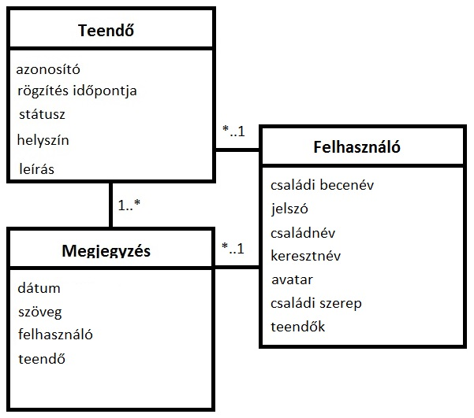

# bead1
This is my first repository on GitHub.

Dokumentáció
A dokumentáció a következő részeket tartalmazza:
•	Követelmény
•	Tervezés
•	Implementáció
•	Tesztelés
•	Felhasználói dokumentáció
Követelmény
Családi Teendők Táblája.
Ezen az oldalon olvashatod a családunk eheti teendőit. A családtagok be tudnak jelentkezni, miután regisztráltak az oldalon. Bejelentkezve mindenki láthatja, hogy milyen feladatok lettek kiosztva a családtagokra.
Lehet módosítani a teendőket, ahol jelezhető, ha megcsináltuk az adott feladatot, vagy megváltoztathatjuk a teendő helyét illetve magát a teendő tárgyát.
A listában lévő teendőkhöz megjegyzés is hozzáfűzhető.
Meglévő teendő törölhető is, ha már el lett végezve.
Azonban törölni csak a szülők törölhetnek teendőket, nehogy a gyerekek elsumákolhassák, amit meg kell csinálniuk. Ezért mindent le kell ellenőrizniük a szülőknek, hogy letudhassunk egy kötelességet.
 
Tervezés
1.	Architektúra terv
-Family_ToDo:
bower.json
fooldal.html
package.json
server.js
-config: 	waterline.js
-controllers: 	comment.js
 	index.js
 	login.js
 	todo.js
-models:	comment.js
 		todo.js
 		user.js
-node_modules
-public
-test:		usermodel.test.js
 		zombie.test.js
-views:	index.hbs
 		layout.hbs
 	-login:	index.hbs
 		signup.hbs
 	-todos:	delete:id.hbs
 		edit:id.hbs
 		list.hbs
 		new.hbs
végpontok:
	/ : index
/logout : kijelentkezés és visszajutás az index-hez
/todos/list : teendők listája
/todos/new : új teendő felvétele
/todos/edit:id : egy teendő szerkesztése
/todos/delete:id : egy teendő törlése
/login : bejelentkezési oldal
/login/signup : regisztrációs űrlap
/comment : megjegyzés
A végpontok elérése és egyik végponttól a másik végpontig való eljutás a controllers mappában lévő .js állományokkal történik. Ezért vannak a főoldalhoz, a bejelentkezéshez, a teendőkhöz és a kommentekhez egy-egy kontroller.
2.	Osztálymodell

 
3.	Dinamikus működés
i.	Szekvenciadiagram
Implementáció
1.	Fejlesztői környezet bemutatása
2.	Könyvtárstruktúrában lévő mappák funkiójának bemutatása
Tesztelés
Automatikus tesztek szükségesek. Nem kell teljeskörű tesztelés, a hallgató mutassa meg, hogy képes ilyen tesztek írására.
1.	Egységtesztek: legalább 1 adatmodell tesztelése: usermodel.test.js
2.	Funkcionális felületi tesztek: legalább 1 folyamat tesztelése
zombie.js használatával

Felhasználói dokumentáció
Family_ToDo
Dokumentáció
Mielőtt elkezdjük használni a Family ToDo honlapot el kell indítanunk a postgresql adatbázist, kapcsolóni kell hozzá.
Ezután már látogatható az oldal. Tehát a kezdő képernyőt egy vendég is nézegetheti, ahol talál leírást arról, hogy mire is való ez az oldal, mire lehet/érdemes használni.
Szóval, ha valaki szeretné használni is, és valódi teendőit följegyezgetni, akkor először is be kell lépni az oldalra. Ehhez a jobb fölső sarokban lévő Bejelentkezés gombra kell kattintani. Ha már regisztrálva vagyunk, akkor bejelentkezéshez írjuk be a családi becenevünket és jelszavunkat, majd kattintsunk a Submit gombra.
Abban az esetben viszont, ha nem vagyunk még regisztrálva, akkor kattintsunk a Regisztráció gombra és adjuk meg a következő adatainkat:
-Családnév, -Keresztnév, -Családi becenév, -Jelszó, -Avatar URL. Ha ezekkel megvagyunk, akkor kattintsunk a Submit gombra. Ekkor már a megadott Családi becenevünkkel és jelszavunkkal be tudunk jelentkezni a Bejelentkezés oldalon.
Bejelentkezve a fönti menüben megjelenik, hogy Üdv, "felhasználónév"! és egy Kilépés opció, melyre kattintva kiléptetjük a felhasználót az alkalmazásból és vissza visszük a kezdőoldalra.
Viszont, ha maradunk bejelentkezve, akkor láthatjuk a család teendőit listába szedve. Minden egyes elvégzendőről látjuk, hogy mikor lett a listához adva; mi a státusza, tehát hogy újonnan felvett, vagy már elkészített, vagy esetleg már le is ellenőrzött; a helyszínét, hogy hol kell a feladatot elvégezni; a leírásást, hogy pontosan mit is kell csinálni és további lehetőségeket, melyek sorban:
- Teendő módosítása, - Megjegyzés, - Teendő törlése.
Az oldal legalján láthatunk egy "Új teendő felvitele" gombot, amelyre rákattintva eljutunk egy Új teendő felvétele oldalra, ahol űrlapként kitöltve a "Helyszín" és "Leírás" feliratokkal ellátott mezőket, és a Submit gombra rákattintva vehetünk fel a listára új teendőket. Ekkor, ha mindent sikeresen kitöltöttünk, akkor visszavisz minket a listához és megjelenik egy felirat, hogy "Új teendő sikeresen felvéve!". Ekkor az újonnan feljegyzett feladat már a listában van.
Ha viszont az Új teendő felvétele oldalon a Cancel gombra kattintunk, akkor a már beírt adatokat visszatörli/reset-eli.
A Családi ToDo feliratra kattintva visszajuthatunk a Teendők listája oldalra. Itt a már említett lehetőségeket választhatjuk minden egyes teendőre.
Tehát egy már meglévő teendőt módosíthatunk a mellette lévő "Teendő módosítása" gombbal, amely elvisz minket egy "Egy elvégzendő dolog módosítása" oldalra, ahol láthatjuk az adott teendő adatait, mint például a Felvételének időpontját, a Státuszát, a Helyszínét és a Leírását. Ez ismételten egy űrlap, amely már előre ki van töltve a tárolt adatokkal, de változtathatunk is rajtuk. A Submit gombra kattintva véglegesíthetjük a változtatást, mely ismét visszavisz minket a Teendő listája oldalra, ha megfelelően töltöttük ki az adatokat, és ekkor megjelenik az oldal tetején az a felirat, hogy "A teendő sikeresen módosítva!". Ha az "Egy elvégzendő dolog módosítása" oldalon vagyunk, de meggondoltuk magunkat és mégsem szeretnénk módosítani az adott teendőn, akkor van rá lehetőségünk. Mégpedig, ha a "Családi ToDo" feliratra kattintunk, akkor visszajutunk a Teendők listája oldalra mindenféle változtatás nélkül. Méh egy lehetőséget nyújt a Meglévő teendő módosítása oldalon a "Cancel" gomb. Ez akkor jöhet jól, hogyha átírtuk a teendőnek valamelyik adatját, de menet közben rájövünk, hogy amire változtattuk az mégsem jó, akkor a szóban forgó gomb semlegesíti a változtatást.
Ezenkívül van még lehetőségünk minden egyes teendőhöz külön megjegyzéseket írni, az egyes teendők melletti "Megjegyzés" gombra kattintva. Itt egy mezőbe felírhatjuk észrevételeinket, gondolatainkat.
Végezetül a Teendők listája oldalán van még lehetőségünk az egyes feladatok törlésére a "Teendő törlése" gombra kattintva. Ez elnavigál minket egy olyan oldalra, amely ad a felhasználónak egy leírást az adott teendő adatairól. Itt a "Törlés" gombra kattintva visszajutunk Teendők listája oldalra, törlődik az adott feladat a listából, és kapunk egy feliratot, hogy "A teendő sikeresen törölve!". Ha viszont meggondoltuk magunkat, és mégsem szeretnénk törölni az adott teendőt, akkor a "Mégse" gombra kattintva visszaugrunk Teendők listája oldalra törlés nélkül.

PostgreSQL konfigurálása Cloud9-on:
# indítás
sudo service postgresql start
# belépés
sudo sudo -u postgres psql
# felhasználó létrehozása az adatbázisban
create user ubuntu password 'ubuntu';
# adatbázis létrehozása
create database tickets owner ubuntu;
# adatbázisok listázása
\list
# kilépés
\q

# adatbázis kiválasztása
\connect tickets
# táblák listázása
\dt

Kódszervezés:
mappák:
-models: az ebben a mappában lévő fájlok az egyes modellek. Jelen esetben vannak a todo.js, amely a tevékenységeket ábrázolja, a user.js, amely a felhasználókat ábrázolja, és a comment.js, amely az egyes megjegyzéseket ábrázolja.
-views: az ebben a mappában lévő fájlok a .hbs állományok, amelyek a megjelenítésért felelősek. Az index.hbs a kezdőoldal leírása. A layout.hbs fájl az egész kinézetért felel. Ami azt jelenti, hogy itt írjuk le, hogyan nézzen ki az oldal alap sémája, a navigációs menü stb. és az oldal adott tartalmát azt ennek a testébe illesztjük bele. A login mappán belül található az index.hbs, amely a bejelentkezési felületért felelős és a signup.hbs a regisztrációs űrlap megjelenéséért. A todos mappán belül list.hbs fájl adja meg, hogy hogy nézzen ki a teendők listája oldal, a new.hbs fájl adja meg, hogy hogy nézzen ki az, amikor új teendőt veszünk fel, az edit:id.hbs fájl ajda, hogy milyen legyen egy teendő módosítása és a delete:id.hbs adja meg, hogy hogyan nézzen ki a teendő törlése.
-controllers (másik neve lehetne routes): ebben a mappában találhatóak az egyes controller-ek. Például a todo.js fájlban leírjuk, hogy amikor a teendőkkel foglalkozunk az alkalmazásban, akkor melyik gombra kattintásnál, illetve melyik végpont/útvonal elérésénél mi történjen. Ugyan ez a login.js fájlban, hogyha a bejelentkezésre, vagy a regisztrációra kattintunk, akkor itt adjuk meg, hogy mi történjen.
-config: konfigurációs állományok
-node_modules: az egyes használt modulokat tartalmazza
-public: lib: -bootstrap, -bootswatch, -jquery használt eszközök
-test: az egyes teszt fájlokat tartalmazza. A usermodel.test.js egy egység teszt a felhasználók helyes működését teszteli. A zombie.test.js egy funcionális teszt, amely az alkalmazás egyes funkcióit teszteli, hogy helyes működik.
